# 0. Stažení iso souboru
>Tento soubor se používá k vytvoření bootovatelného média, které umožňuje instalaci operačního systému na nový počítač, nebo také jeho obnovu.

## 0.1 Stažení
1. Půjdeme na stránku https://archlinux.org/download/
2. Vybereme nejbližší mirror
3. Stáhneme [archlinux-2023.03.01-x86_64.iso](https://mirror.dkm.cz/archlinux/iso/2023.03.01/archlinux-2023.03.01-x86_64.iso)

# 1. Tvorba VMware virtálního prostředí
>Tvorba virtuálního prostřední / virtálního počítače ve kterém bude Arch Linux běžet
## 1.1 Stáhnutí programu WMware Workstation Player
1. Půjdeme na stránku [WMware.com](https://customerconnect.vmware.com/en/downloads/details?downloadGroup=WKST-PLAYER-1701&productId=1377&rPId=100675)
2. Stáhneme edici programu pro náš systém

## 1.2 Instalace Programu WMware Workstation Player
1. Otevřeme stažený soubor
2. Na další straně si přečteme podmínky
3. Potvrdíme že jsme si přečtli licenční podmínky
4. Projedeme instalací.. Není potřeba nic měnit všude pouze "`Next`"
5. A dokončíme instalaci 

## 1.3 Tvorba Virtálního počítače
1. Zapneme program
2. Klikneme na "`Create a New Virtual Mechine`"
3. Vybereme "`Installer disc image file (iso)`"
5. Najdeme a vybereme naš iso soubor `archlinux-2023.03.01-x86_64.iso`
7. Na další stránce vybereme "`Linux`"
8. Ve "Version" vybereme "`Other Linux 5.x kernel 64-bit`"
10. Na další stránce pojmenujeme náš virtuální počítač
12. Vybereme kam jej chceme uložit
14. Na další stránce zadáme maximální velikost disku (Nejméně 30GB)
15. Vybereme "`Store virtual disk as single file`" pro lepší přenášení
16. Na další stránce změníme Hardware:
**Doporučuji:**
- Ram: Více jak 2Gb
- Processors: 2. Minimálně pro lepší zážitek více pokud je to možné
- Virtualization engine: Pokud je možné zapněte
- Network Adapter: Nejlépe NAT, záleží na vás

17. Klikneme `"Finish"`

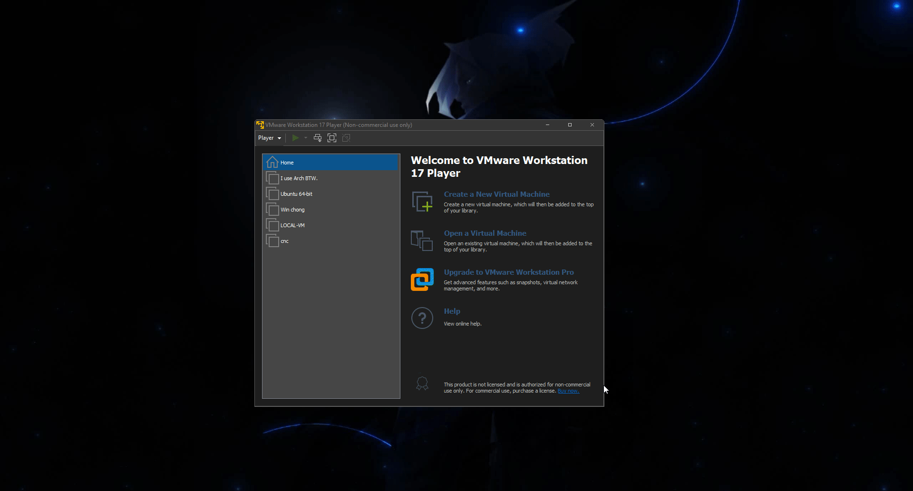

# 2 Instalace Operačního Systému Arch Linux
>Celý instalační proces systému Arch Linux
>*Já jej instaluji jako co nejmenší a jen s zakl.funkcemi*

## 2.1 Tvorba "prvního/celkového oddílu"
1. Zapneme Virtuální počítač "`Play virtual mechine`"
2. Počkáme než se zapne a načte systém do operačního řádku
3. Zjistíme si jméno disku na kterém budeme dělat partice `fdisk -l` = Můj disk = `/dev/sda`
4. Začneme proces dělaná particí `fdisk /dev/sda`  *= ve většině případů `/dev/sda` je jméno našeho zařízení.. může se ovšem lišit..*
5. Napíšeme `o` pro vytvoření nové tabulky oddílů
6. Napíšeme `n` pro zvolení typu oddílu
7. Vybereme `p` pro zvolení primárního typu oddílu
8. Vybereme `1` u čísla oddílu (Zakl)
9. Potvrdíme první sektor (Zakl)

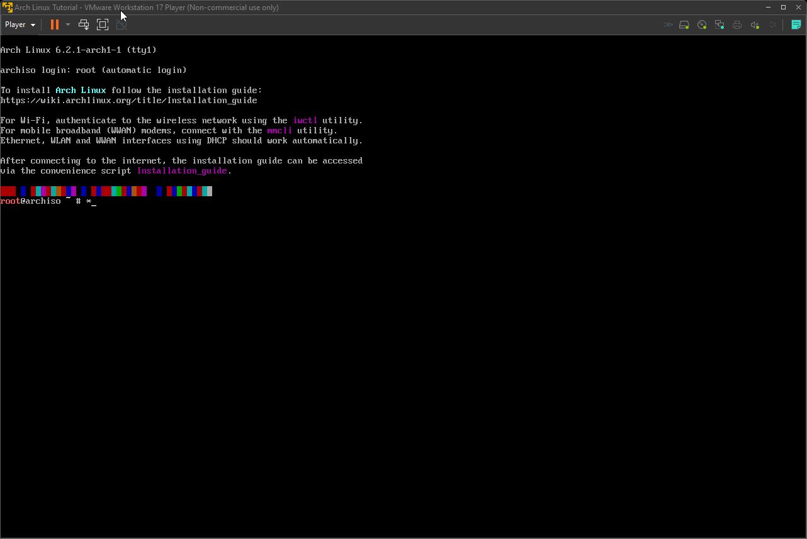

# 2,2 Změnení typu celkového oddílu na LVM
*Pořád jsme v fdsiku*
1. Napíšeme `t` pro výběr
2. Napíšeme alias pro lvm `8e`

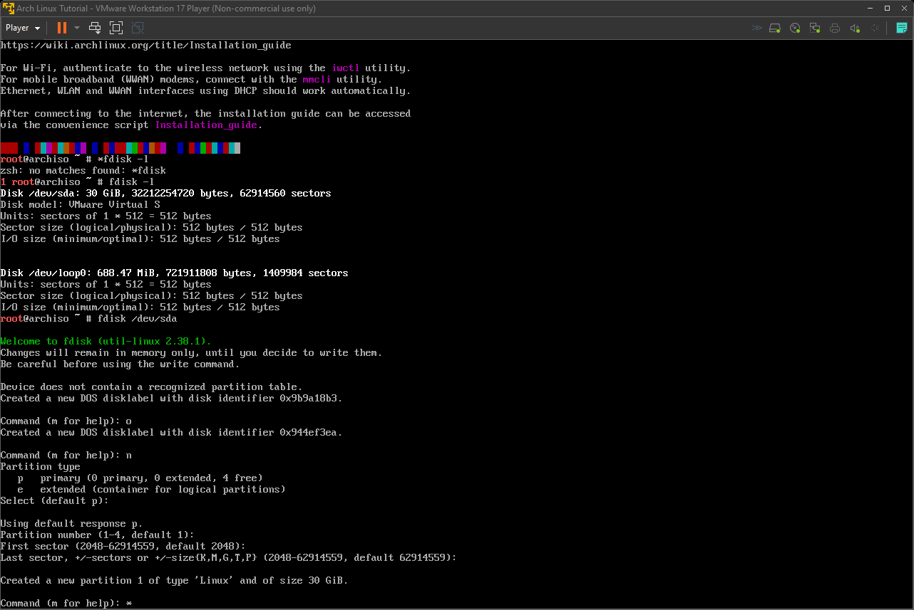

## 2,3 Nastavení oddílu jako bootable a uložení všech provedených změn
*Pořád jsme v fdsiku*
1. Napíšeme `a` pro nastavení bootable možnosti
2. Napíšeme `w` pro "uložení" všech změn

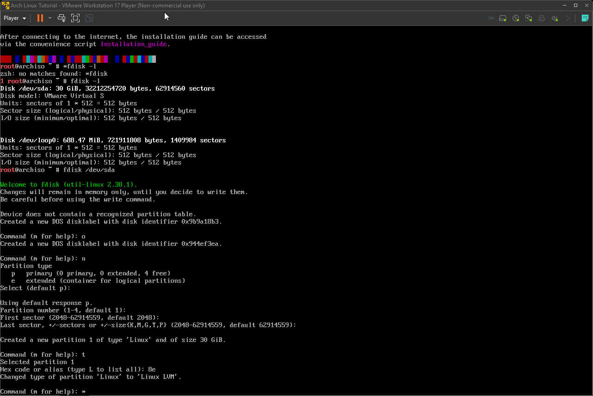
*Můžeme se podívat na změny které jsme udělal příkazem `fdisk -l`*
*Náš svazek se jmenuje `/dev/sda1`*

## 2,4 Nastavení LVM
### 2,4,1 Tvorba fyzického svazku
1. Napíšeme `pvcreate --dataalignment 1m /dev/sda1` *= vytvoří fyzický svazek a srovná na dnešní standard 1m na oddílu `/dev/sda1`*

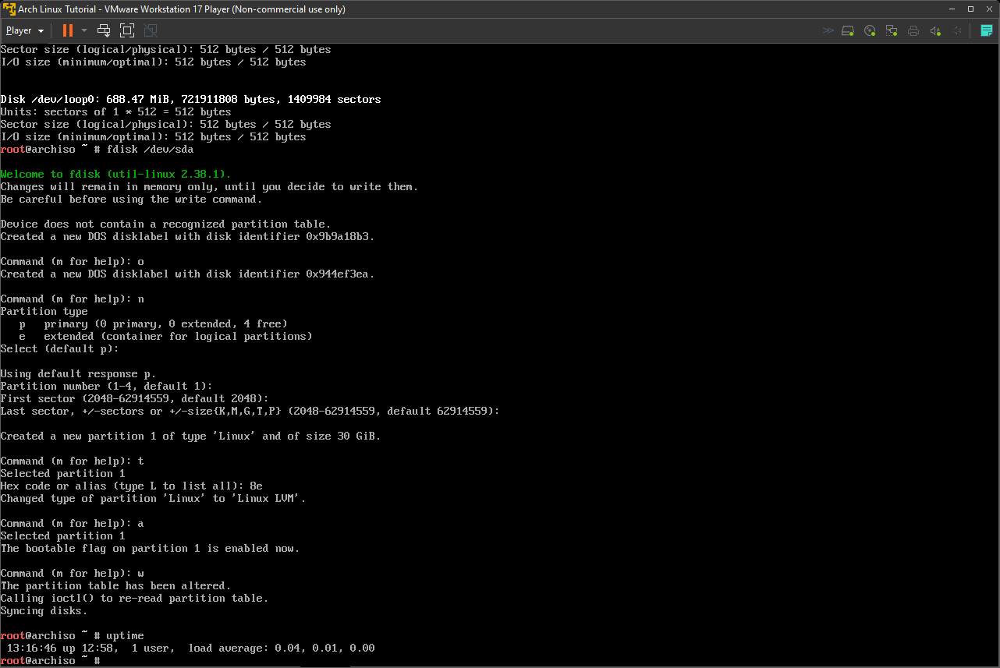

### 2,4,2 Tvorba skupiny svazků
1. Napíšeme  `vgcreate volumegroup0 /dev/sda1` *= `volumegroup0` jako jmeno,`/dev/sda1` jako jméno svazku*

### 2,4,3 Tvorba logických LVM svazků
1. Napíšeme `lvcreate -L 10GB volumegroup0 /dev/sda1 -n lvroot` pro vytvoření skupiny "`lvroot`" *= `10GB` jako velikost skupiny, `volumegroup0` jméno naší logické skupiny, `/dev/sda1` je požadovaný oddíl, `-n lvroot` jako jméno naší skupiny*

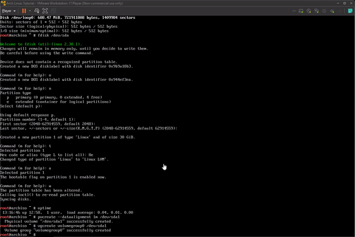

2. Napíšeme `lvcreate -L 15B volumegroup0 /dev/sda1 -n lvhome` pro vytvoření skupiny "`lvhome`" kde se budou ukládat naše data. Zadaní velikosti můžeme pozměnit jak chceme nebo nastavit aby skupina zaplnila celý zbytek:` -l 100%FREE`= *`15B` jako velikost skupiny, `volumegroup0` jméno naší logické skupiny, `/dev/sda1` je požadovaný oddíl, `-n lvhome` jako jméno naší skupiny*

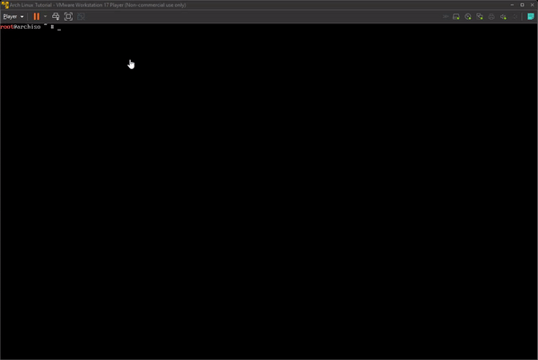

### 2,4,4 Načtení naší nové skupiny svazků
1. Napíšeme `modproble dm_mod` pro načtení našich skupin

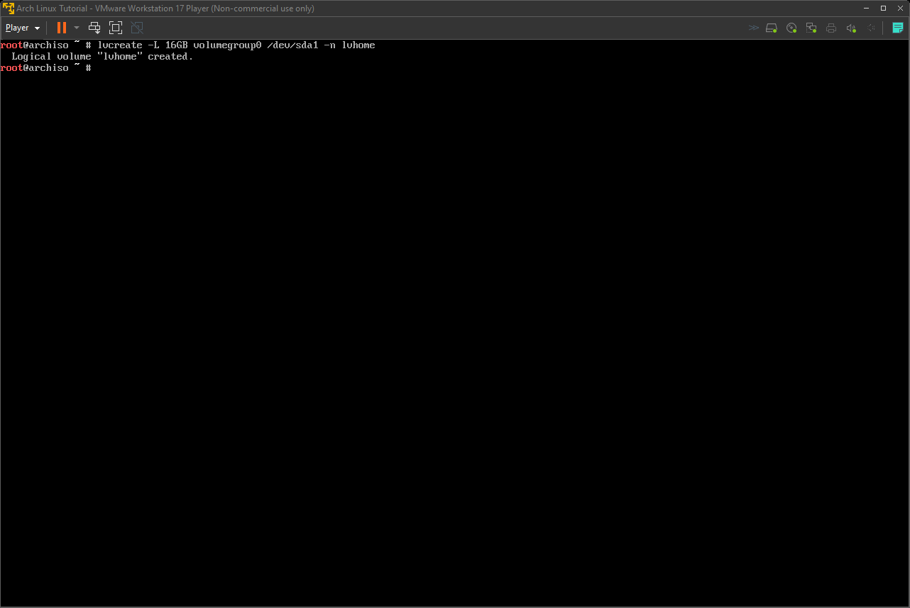

### 2,4,5 Aktivace skupiny svazků
1. Napíšeme `vgscan` tím prohledáme systém o logické skupiny aby věděl s čím pracovat
2. Napíšeme `vgchange -ay` pro aktivaci skupin

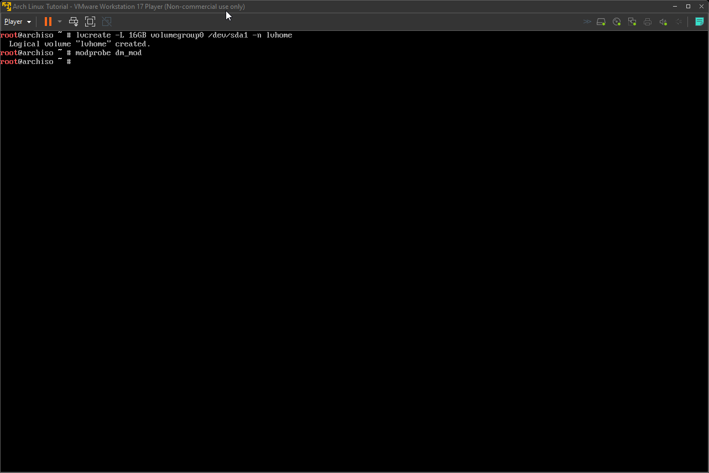

## 2,5 Formátování logických svazků
1. Napíšeme `mkfs.ext4 /dev/volumegroup0/lvroot` pro naformátovaní `lvroot` svazku na souborový systém ext4 *= `volumegroup0` je naše logická skupina*

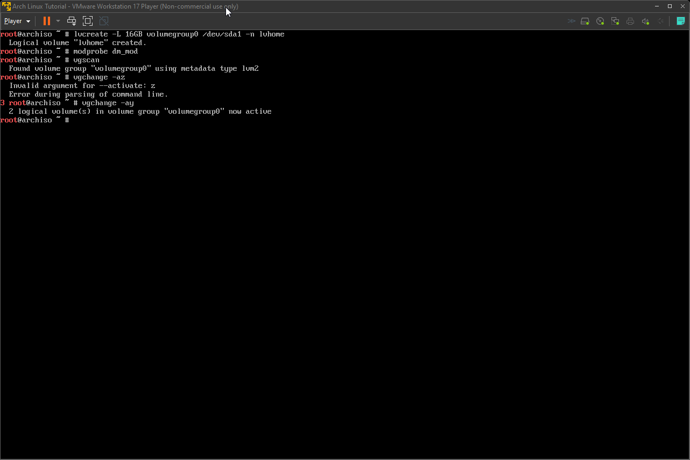

1. Napíšeme `mkfs.ext4 /dev/volumegroup0/lvhome` pro naformátovaní `lvhome` svazku na souborový systém ext4 *= `volumegroup0` je naše logická skupina*

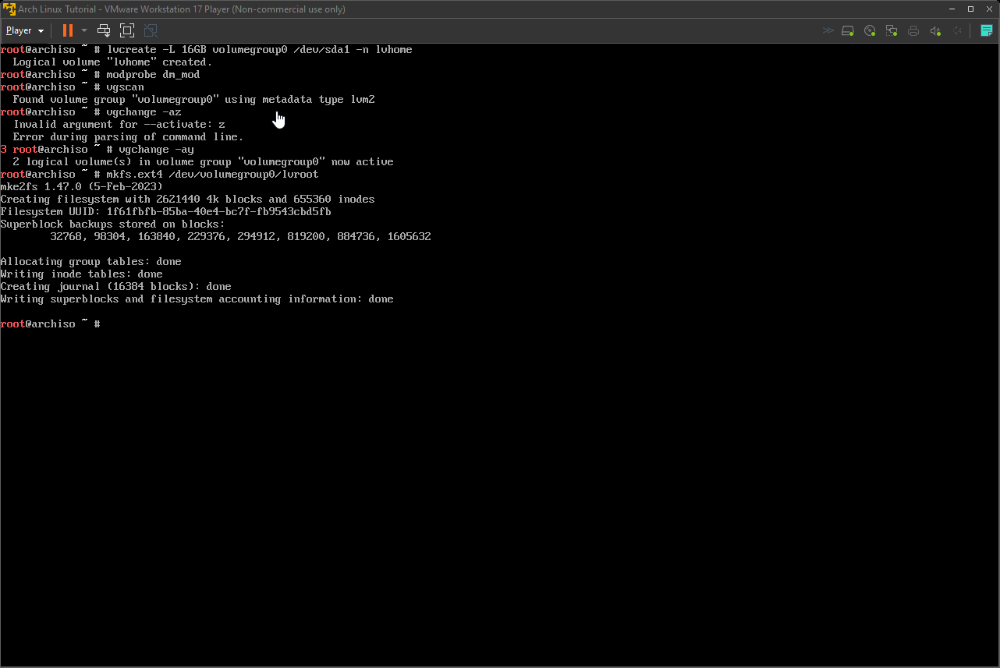

## 2.6 Mountnutí našich logických svazků
1. Napíšme `mount /dev/volumegroup0/lvroot /mnt` *= mountne svzek na cestu `/mnt`*

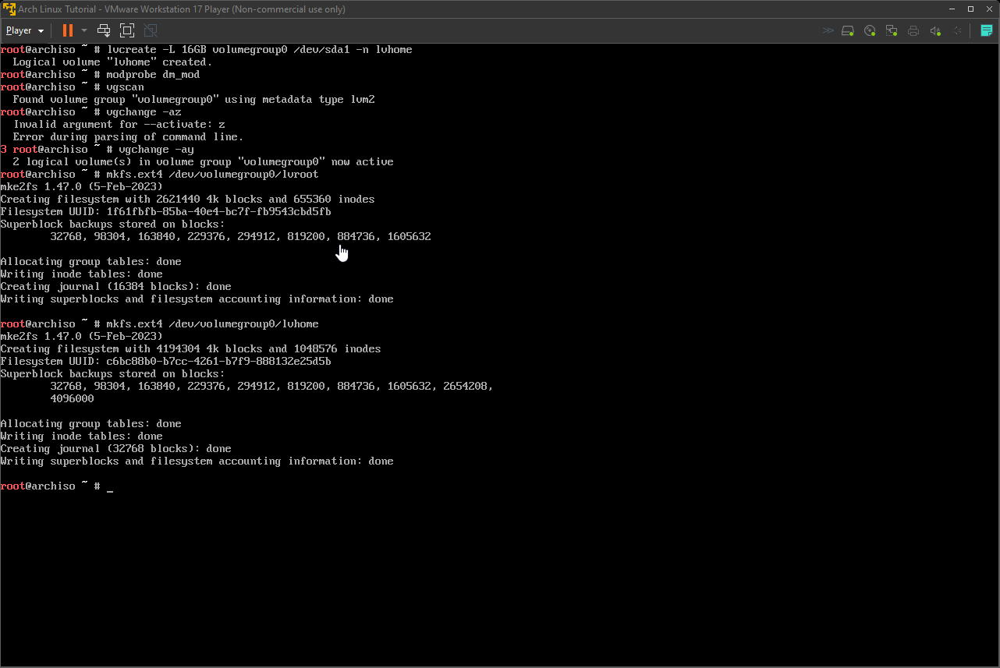

2. Napíšeme `mkdir /mnt/home/` pro vytvoření cesty kam mountneme svazek `lvhome`
3. Napíšme `mount /dev/volumegroup0/lvhome /mnt/home` *= mountne svzek na naší vytvořenou cestu `/mnt/home`*

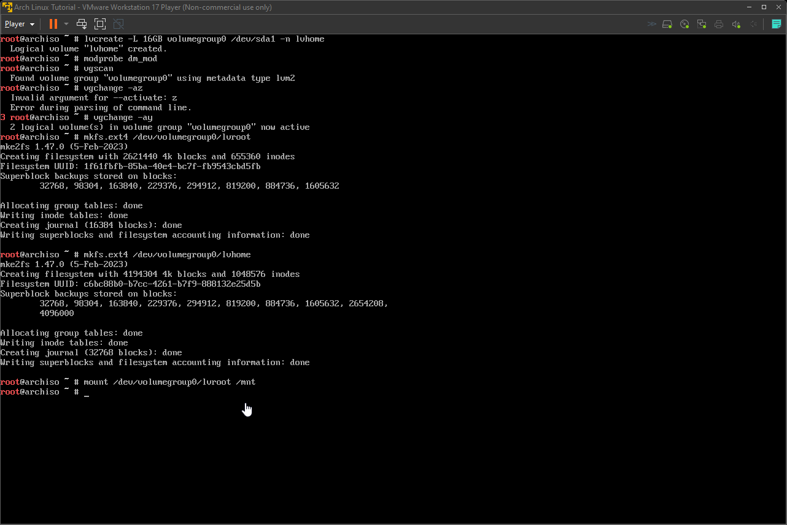

## 2,7 Dotvoření rozložení diskových oddílů a uložení
1. Vytvoříme si cestu `/mnt/etc` příkazem `mkdir /mnt/etc` *= `/mnt/etc` je naše cesta*
2. A uložíme naše rozložení pomocí příkazu `genfstab -U -p /mnt >> /mnt/etc/fstab` a jeho output přesmerujeme do `/mnt/etc/fstab`
3. Pomocí příkazu `cat` si ověříme zda je vše správně `cat /mnt/etc/fstab` UUID by měli být rozdílné a formát ext4

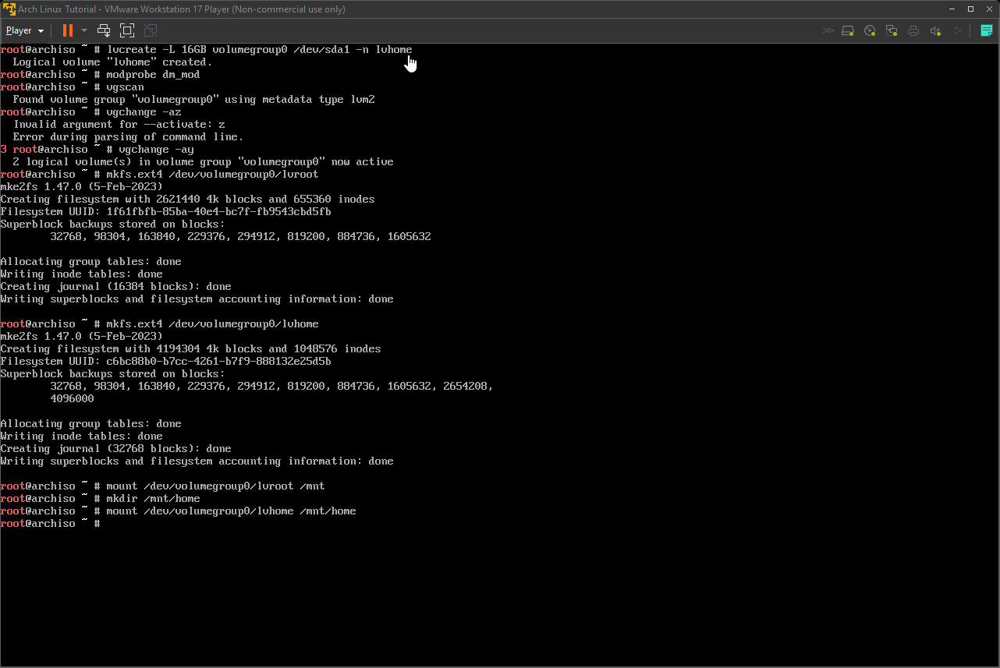

# 3 Samotná Instalace Arch Linux

## 3,1 Instalace základních balíčků
1. Pomocí příkazu `pacstrap` nainstalujeme základní balčíky pomocí skupiny `"base"` tedy `pacstrap -i /mnt base` *= `/mnt` je cesta, `base` je název skupiny*

## 3,2 Vstup do instalace
1. Pomocí příkazu `acrch-chroot /mnt` vstoupíme do instalace *= `/mnt` pro cestu*

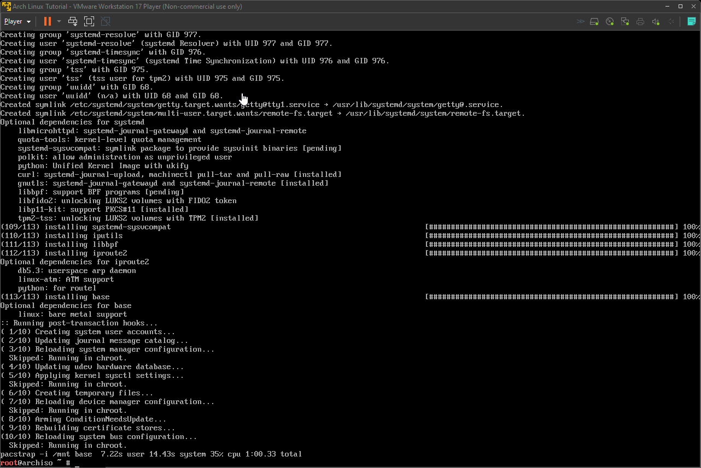

## 3,3 Instalace Linuxového kernelu a headers verze lts
1. Pomocí instlalačního manažeru  `pacman` stáhneme linuxový kernel verzi lts tedy: `pacman -S linux-lts linux-lts-headers`

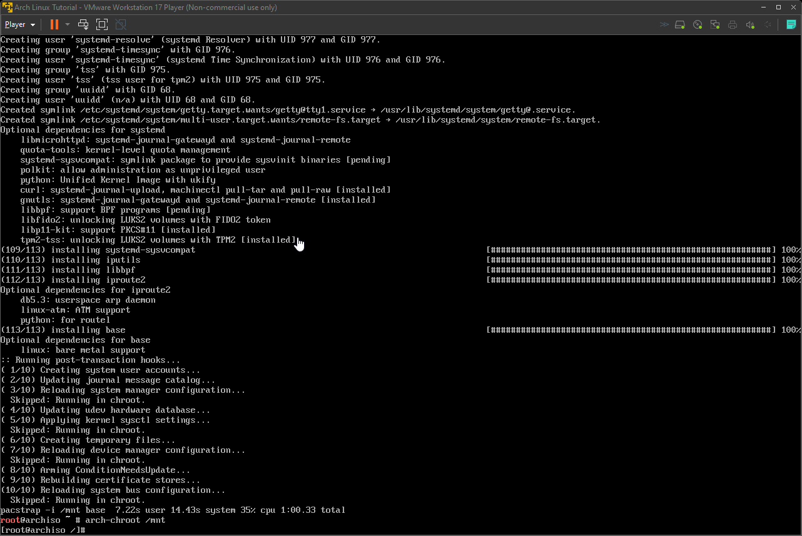

## 3,4 Instalace podstatných balíčků
1. Nějaký editor se bude určitě hodit Př: Nano, Vim. Já zvolím editor `"nano"` tedy `pacman -S nano`
2. Nainstalujeme také vývojové balíčky budou se hodit. `pacman -S base-devel`
3. Také stáhneme `"networkmanager"` také se bude hodit. `pacman -S networkmanager`
4. A pro lepší užití můžeme stáhnout `netctl`. `pacman -S netctl`
5. Zapneme `"NetworkManager"` při startu / bootu zařízení. `systemctl enable NetworkManager`
6. Také musíme stáhnout `"lvm2"` balíček který je nutný. `pacman -S lvm2`

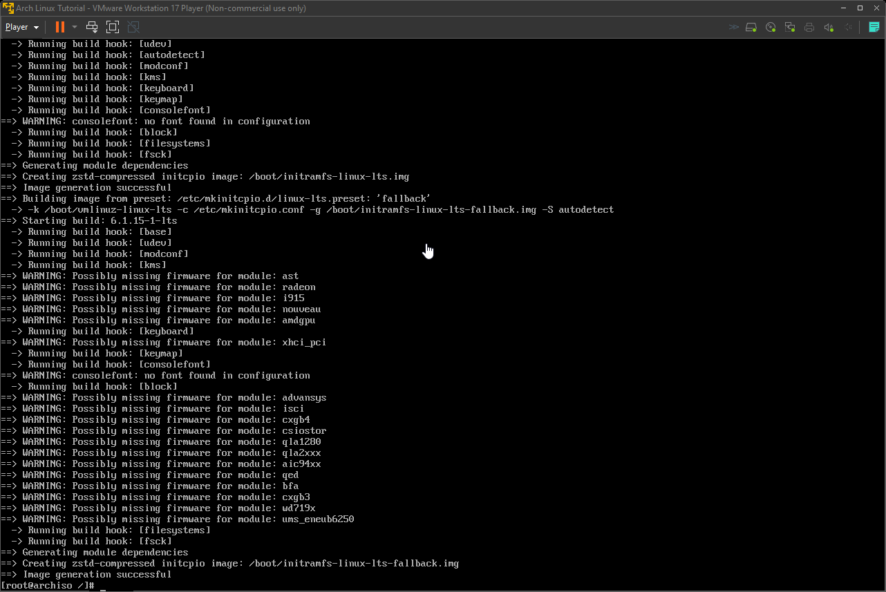
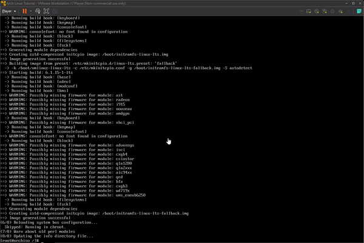

## 3,5 Změnění konfigurace pro lvm
1. V našem editoru si otevřeme soubor `/etc/mkinitcpio.conf`. `nano /etc/mkinitcpio.conf`
2. Najdeme řádek který nemá na začáítku "`#`" `HOOKS=(base udev autodetect modconf block filesystems keyboard fsck)`
3. Mezi `block` a `filesystems` vložíme `lvm2` s mezerou na každé straně. Takto:  `HOOKS=(base udev autodetect modconf block lvm2 filesystems keyboard fsck)`
4. Uložíme změny

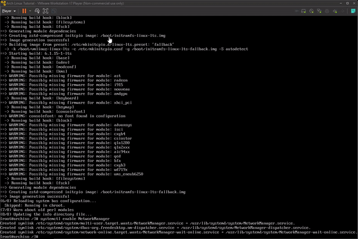

### 3,5,1 Potvrzení konfigurace s lvm
1. Napíšeme `mkinitcpio -p linux-lts` pro "uložení" naší konfigurace *= `linmux-lts` je náš kernel*

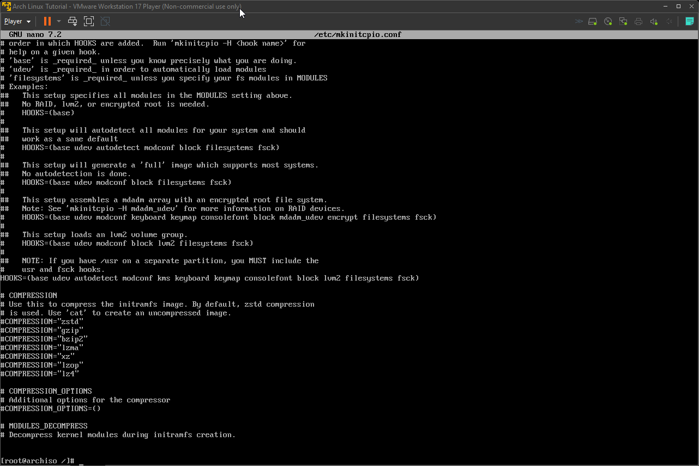

## 3,6 Nastavení našeho localu
1. V našem editoru si otevřeme `/etc/locale.gen`. V mém případě `nano /etc/locale.gen`
2. Najdeme náš local a odstraníme "`#`" před daným řádkem
3. Uložíme
4. Vygenerujeme nás local příkazem `locale-gen`

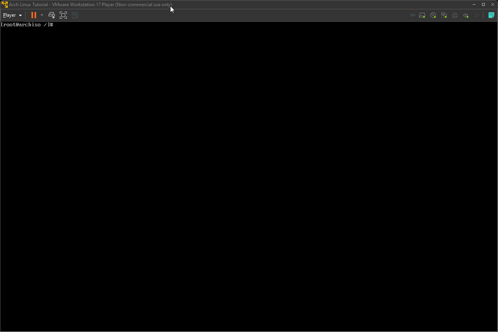

## 3,7 Konfigurace uživatelů
### 3,7,1 Změna hesla pro účet root
1. Nastavíme si nějaké bezpečné heslo pro účet root. `passwd root`
2. Zadáme heslo

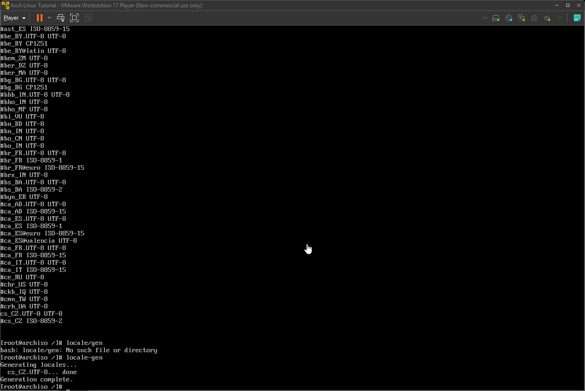

### 3,7,2 Tvorba uživatelského účtu
1. Vytvoříme nového uživatele příkazem `useradd -m -g users -G wheel uzivatel` *= `-m` vytvoří uživatelu složku, `-g users` nastaví primární skupinu na `users`, `-G wheel` přidá uživatele do skupiny `"wheel"` používané pro dávání administrátorských práv, `uzivatel` je jméno uživatele*
2. Nastavíme heslo od uživatele. `passwd uživatel`

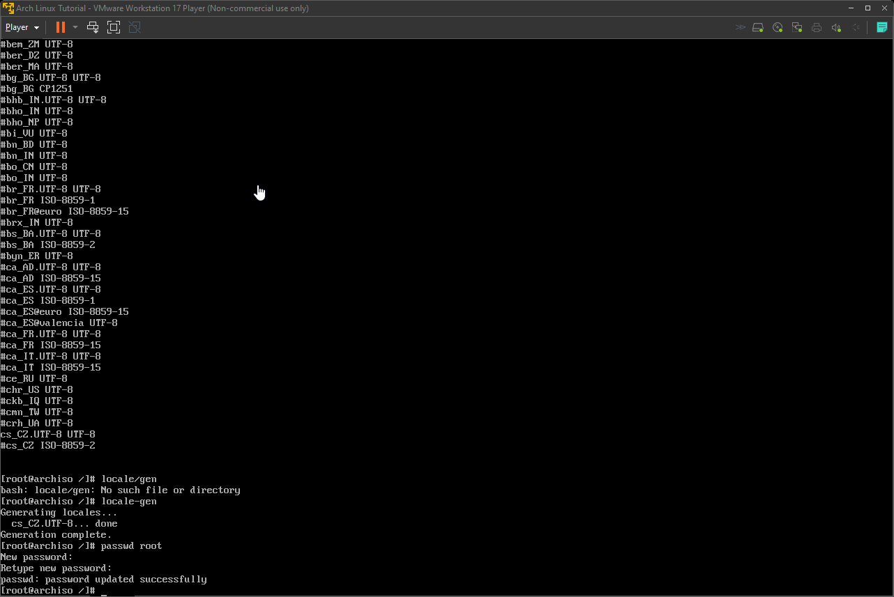

## 3,8 Konfigurace SUDO
1. Ujistíme se že sudo je stažené příkazem `which sudo` pokud není tak jej stáhneme `pacman -S sudo`
2. Donutíme náš editor otevřít konfiguraci sudo. `EDITOR=nano visudo` místo nano můžete vložit jméno vašeho editoru.
3. Najdeme řádek `# %wheel ALL=(ALL) ALL` odstraníme "`#`" a smažeme mezeru. Takto: `%%wheel ALL=(ALL) ALL` *= Umožnili jsme skupině wheel použivat sudo. Pod touto skupinou je náš uživatel*
4. Uložíme

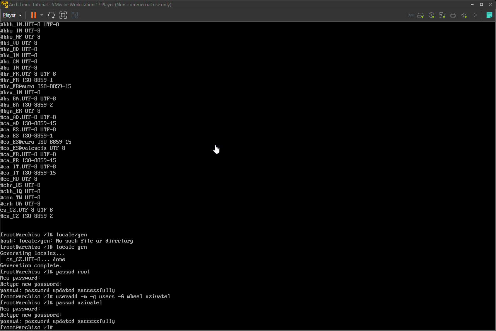

# 4 Instalace GRUB
## 4,1 Instalace balíčků pro GRUB
1. Stáhneme balíčky `grub` `dosfstools` `os-prober` `mtools`. Tedy: `pacman -S grub dosfstools os-prober mtools`

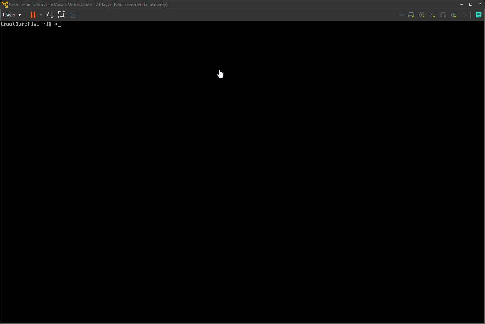

## 4,2 Samotná instalace GRUB
1. Napíšeme instalační příkaz `grub-install`. Tedy: `grub-install --target=i386-pc --recheck /dev/sda` *= `--target=i386-pc` specifikujeme architekturu, `--recheck /dev/sda` specifikujeme zařízení

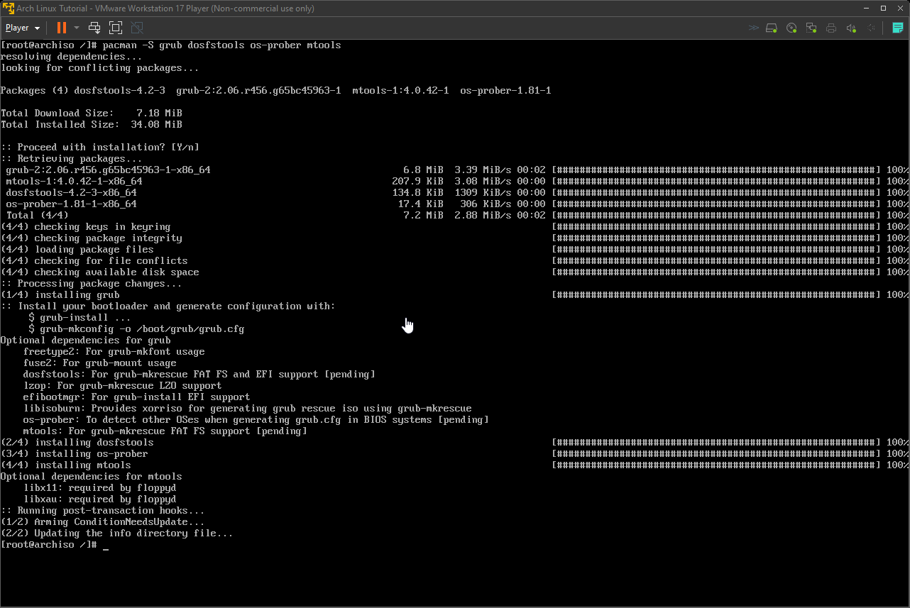

## 4,3 Tvorba locale pro GRUB
1. Ověříme si zda locale existuje pomocí příkazu `ls`   `ls -l /boot/grub` *= `/boot/grub`je cesta*
2. V listu musí být vidět `"locale"`. Pokud není tak jí vytvoříme  příkazem `mkdir /boot/grub/locale`
3. Nastavíme anglický locale pro grub / příkazem cp neboli copy zkopírujeme správný soubor z `/usr/share/locale/en\@quot/LC_MESSAGES/grub.mo` do grub složky `/boot/grub/locale/en.mo.` Tedy: `cp /usr/share/locale/en\@quot/LC_MESSAGES/grub.mo /boot/grub/locale/en.mo`

## 4,4 Generování GRUB konfigurace
1. Vytvoříme GRUB konfig příkazem `grub-mkconfig -o /boot/grub/grub.cfg` *= `-mkconfig` jako makeconfig,`-o /boot/grub/grub.cfg` specifikuje cestu*

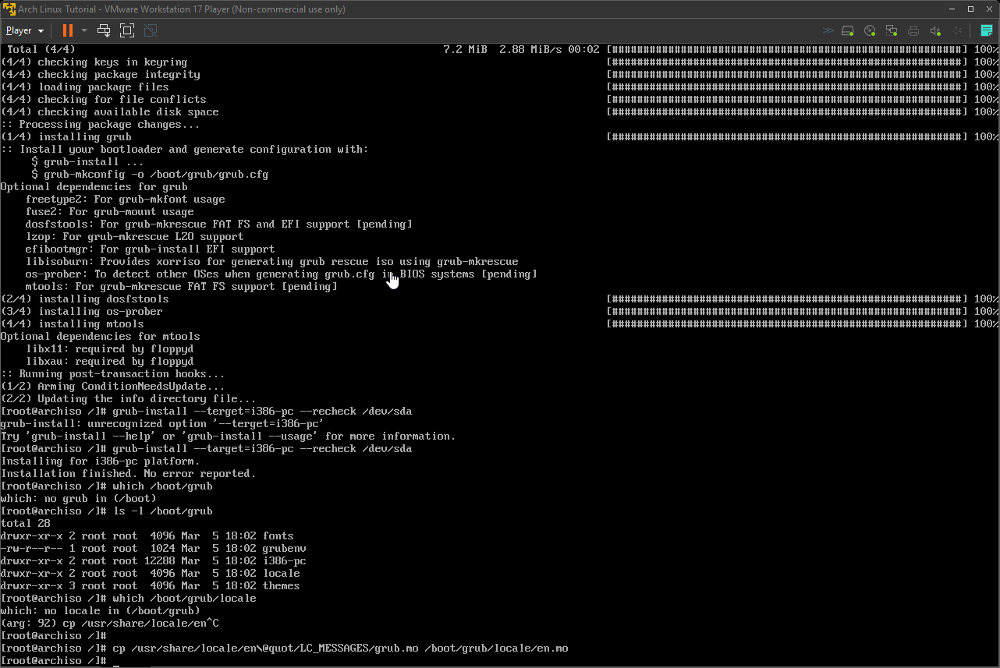

# 5 Dokončení Instalace Arch Linux

## 5,1 Opuštění instalace
1. Pro odchod z instalace napíšeme `exit`
2. A vše unmountnem `umount -a` *= `-a` pro vše*
3. Pak můžeme `reboot`

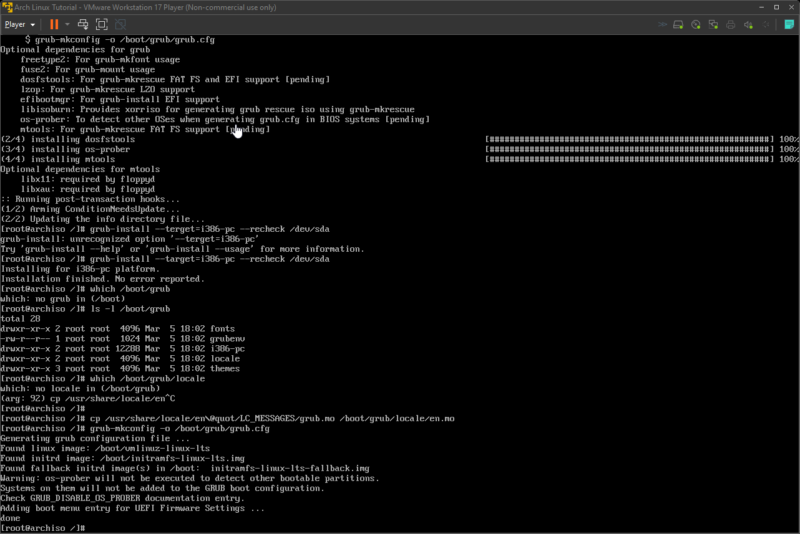

## 5,2 Duležitá konfigurace po dokončení instalace

### 5,2,1 Konfigurace času
1. Najdeme si naší časovou zónu na této [stránce](https://www.epochconverter.com/timezones) moje časová zóna je `"Europe/Prague"`
2. Nastavíme zónu příkazem:  `timedatectl set-timezone Europe/Prague` 

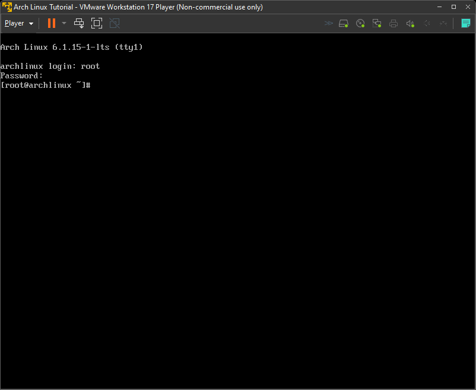

### 5,2,2 Zapnutí synchrinizace času
1. Napíšeme  `systemctl enable systemd-timesyncd`

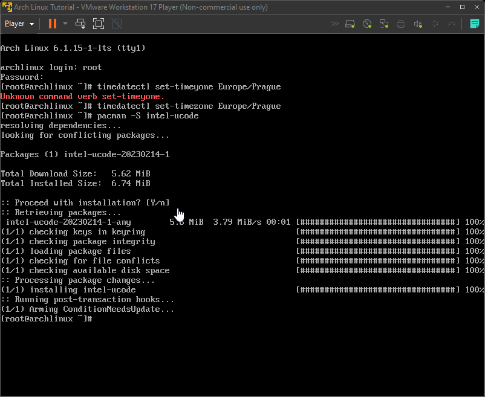

## 5,3 Stažení Micro Code pro váš procesor
1. V případě Intelu stáhneme balíček  `intel-ucode `. Tedy:  `pacman -S intel-ucode `
1. V prípadě Amd stáhneme balíček  `adm-ucode`. Tedy:  `pacman -S amd-ucode` 

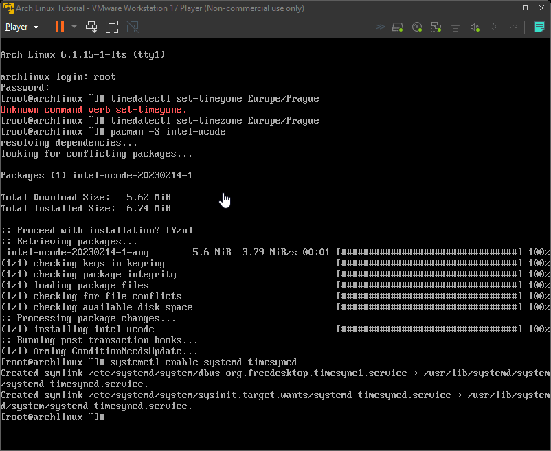

# 6 Dobrovolné: Instalace Desktopového prostředí GNOME a ostatní
>Záleží na člověku a na tom k čemu bude zařízení sloužit. Existuje více prostředí ale já použiju prostředí GNOME.

## 6,1 Instalace duležitých balíčků
1. Nainstalujeme balíček  `xorg-server ` který je potřebný pro chod prostředí. Tedy:  `pacman -S xorg-server `
2. Nainstalujeme balíček ovladače pro náš grafický čip. Pro Intel integrovanou grafiku:  `mesa`, pro Nvidia:  `nvidia-lts`, pro Wmware:  `xf86-video-wmware`, pro VirtualBox  `virtualbox-guest-utils ` v mém případě stáhnu  `xf86-video-wmware`. Tedy:  `pacman -S xf86-video-wmware` 
3. A nakonec stáhneme Gnome. Tedy:  `pacman -S gnome`

## 6,2 Zapnutí GnomeDesktopManager
1. Napíšeme příkaz pro zapnutí gdm/GnomeDesktopManager  `systemctl enable gdm`
2. A poté restartujeme

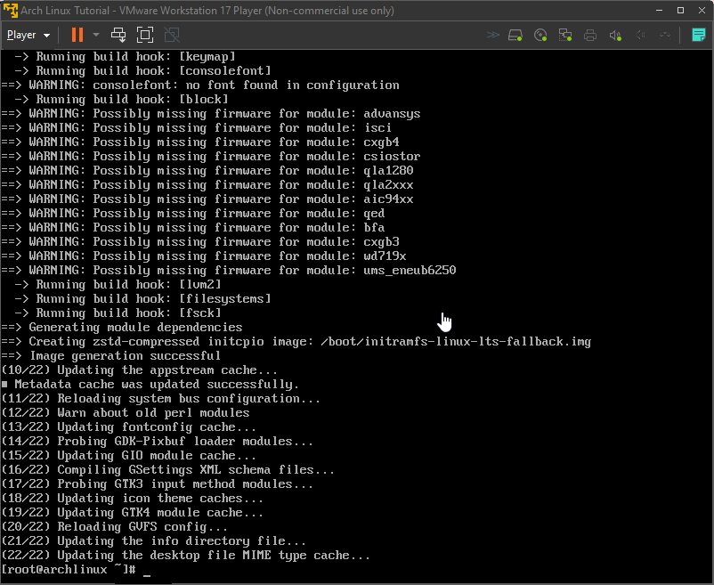

# A Máme Hotovo! 
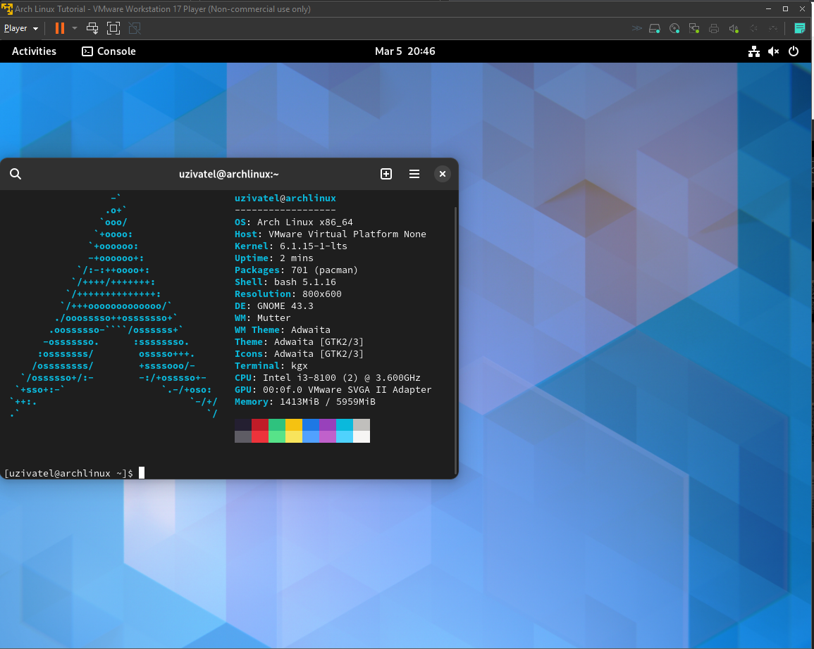

## Info
- © Jiří Edelmann | DEPSTRCZ - 2023
- Host PC:
	- `Intel i3-8100`
	- `16Gb ram DDR4`
	- `GPU: Nvidia GTX 1650SUPER`
- Návod pro instlaci programu VmWare byl dokumentován na mém notebooku protože na hlavním pc už jsem jej stáhnutý měl.
- Čistá instlace mi zabrala: 47 Minut + Instalace Gnome 6 Minut
- Vytvořeno v rámci úkolu na předmět OSY na škole *Vyšší odborná škola, Střední průmyslová škola a Střední odborná škola, Varnsdorf p.o.*
